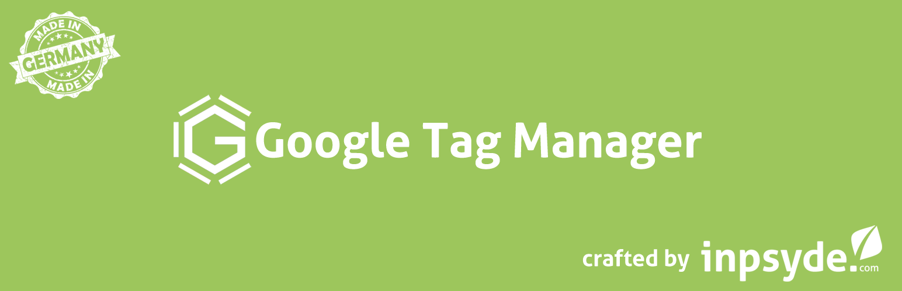

# Inpsyde Google Tag Manager

[](https://packagist.org/packages/inpsyde/google-tag-manager)
[](https://github.com/inpsyde/google-tag-manager)
[](https://travis-ci.org/inpsyde/inpsyde-google-tag-manager)
[](https://codecov.io/gh/inpsyde/google-tag-manager)
[](https://packagist.org/packages/inpsyde/google-tag-manager)
[](https://packagist.org/packages/inpsyde/google-tag-manager)

> Inpsyde Google Tag Manager inserts the GTM Container Code on every page of your WordPress site and writes data to the Data Layer.



## Documentation

Documentation can be found in [readme.txt](readme.txt).

## Requirements

* WordPress >= 4.6.
* PHP 8.0 or higher.

## How to start development

This plugin does not include build assets and PHP-dependencies. Therefore, after loading that repository via Composer or git checkout you have to install them.

**With Yarn:**

```shell
yarn install && yarn build:dev
```

For more information, please refer to the [Symfony Encore docs](https://symfony.com/doc/current/frontend.html#webpack-encore)

## Testing & Quality

To run all tests you've to install composer dev-dependencies first.

## PHPCS

```bash
vendor/bin/phpcs
```

## PHPUnit

```bash
vendor/bin/phpunit
```

This repository automatically generates a CodeCoverage-report into the `tmp/`-folder, which will not be committed.

## Behat

* Behat Docs: <http://docs.behat.org/en/latest/guides.html>
* Wordhat: <https://wordhat.info/>

To run Behat locally you need a running Selenium-Server. This package provides the [vvo/selenium-standalone](https://github.com/vvo/selenium-standalone) as `devDependency` via NPM. You can simple run `npm install` and start the `selenium`-task to have a running Selenium-Server.

For local testing you can use a `behat.local.yml` by copying the existing `behat.yml`. To run Behat locally you've to change the `Behat\MinkExtension.base_url` and `PaulGibbs\WordpressBehatExtension.path` to match your local setup.

```bash
vendor/bin/behat --config behat.local.yml
```

**Note:** Behat is testing WordPress currently as default installation with language "english".

## License
   
Copyright (c) 2017 Inpsyde GmbH.
